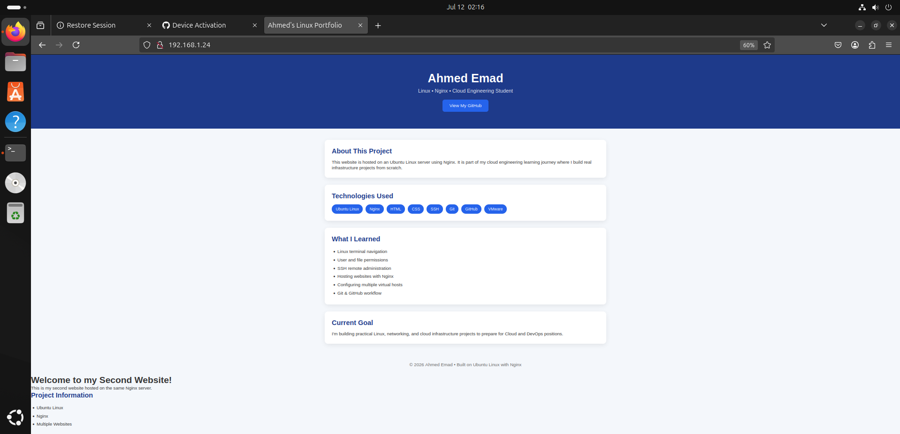

# Nginx Multi-Site Hosting on Ubuntu

## Overview

This project demonstrates how to host multiple websites on a single Ubuntu Linux server using Nginx.

The server hosts:

- A portfolio website on the default HTTP port (80)
- A second website on port 8080

The project was built as part of my Cloud Engineering learning journey and demonstrates Linux server administration, Nginx configuration, SSH remote management, and Git version control.

---

## Features

- Ubuntu 24.04 LTS
- Nginx Web Server
- Hosted multiple websites on a single server
- Configured separate document roots
- Configured multiple listening ports (80 & 8080)
- SSH Remote Administration
- HTML & CSS Landing Pages
- Git Version Control
- GitHub Repository

---

## Project Structure

```text
/var/www
├── html
│   └── index.html
└── portfolio
    └── index.html
```

---

## Site Configuration

| URL | Document Root |
|------|---------------|
| http://192.168.1.24 | `/var/www/portfolio` |
| http://192.168.1.24:8080 | `/var/www/html` |

---

## Nginx Configuration

```text
/etc/nginx/sites-available
├── default
└── portfolio
```

Enabled Sites

```text
/etc/nginx/sites-enabled
├── default
└── portfolio
```

---

## Architecture

```text
                 Client
          (Browser / SSH)
                 │
                 ▼
        Ubuntu Linux Server
           192.168.1.24
                 │
                 ▼
               Nginx
        ┌────────┴────────┐
        ▼                 ▼
     Port 80          Port 8080
 Portfolio Site      Original Site
/var/www/portfolio   /var/www/html
```

---

## Technologies Used

- Ubuntu 24.04 LTS
- Nginx
- HTML5
- CSS3
- SSH
- Git
- GitHub

---

## Skills Demonstrated

- Linux System Administration
- Nginx Configuration
- Multi-Site Hosting
- SSH Remote Management
- Linux File Permissions
- Git Version Control
- GitHub Repository Management

---

## What I Learned

- Linux command-line navigation
- Managing users and file permissions
- Configuring Nginx server blocks
- Hosting multiple websites on a single server
- Configuring Nginx to listen on multiple ports
- Managing websites over SSH
- Using Git and GitHub for version control

---

## Future Improvements

- Configure HTTPS using Let's Encrypt
- Deploy a Flask application behind Nginx
- Containerize the application using Docker
- Deploy the project to AWS EC2
- Configure CI/CD using GitHub Actions

---

**Author:** Ahmed Emad

Built as part of my Cloud Engineering learning journey.


---

## Screenshot

### Portfolio Website


